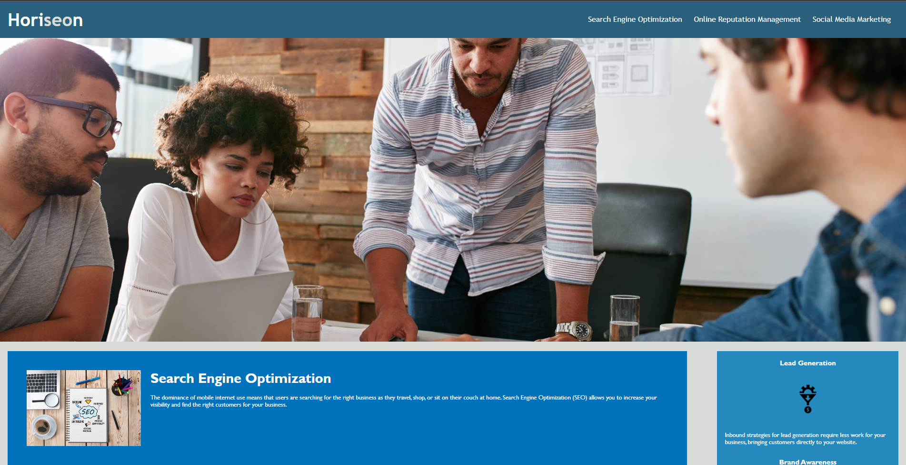
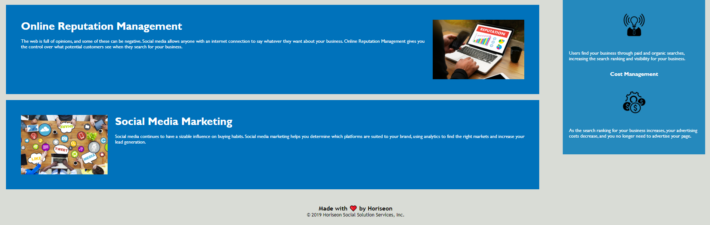

# marketing-agency-refactor

## Code refator for the Horiseon Social Solution

- Replaced non-semantic elements in html
- Reordered the semantic html structure and css codes to be alignment with each other
- On HSSS page links works correctly
- Added descriptive alt attributes to images tags
- Removed a redundancies codes
- Added comments in the html and css files
- All images were resized to the values found in css file
- Grouped services and benefits codes in css file
- Added title

## Some screenshots

## https://github.com/katarzynajk/marketing-agency-refactor.git
